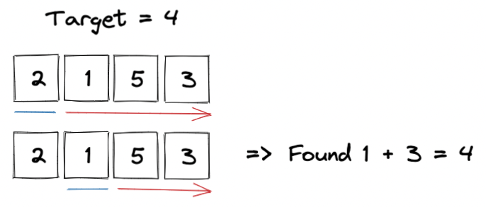
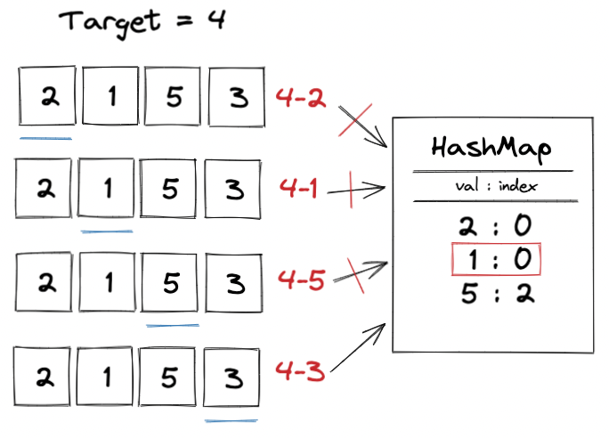
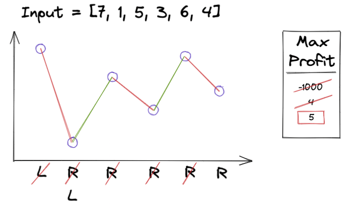

# Technical Interview Questions


## Leetcode BLIND-75


Two Sum - HashMap (Leetcode 1)

Sliding Window: Best Time to Buy and Sell Stock (Leetcode 121)

Product of Array Except Self (Leetcode 238)


### Two Sum - HashMap (Leetcode 1)

> ---
>
> **Problem Description:**
>
> Given an array of integers, return indices of the two numbers such that they add up to a specific target.
>
> You may assume that each input would have exactly one solution, and you may not use the same element twice.
>
> ---
>
> **Example:**
>
> Given nums = [2, 7, 11, 15], target = 9
>
> Because nums[0] + nums[1] = 2 + 7 = 9 => return [0, 1]
>
> **Example 2:**
>
> Given nums = [2, 1, 5, 3], target = 4
>
> Because nums[1] + nums[3] = 1 + 3 = 4 => return [1, 3]
>
> ---

<details>
    <summary>Brute force solution: O(n^2)</summary>
    <br />
    
</details>

<details>
    <summary>One pass solution O(n)</summary>
    <br />
    
    <br />
    The solution is found when the second number is selected (underlined in blue)
</details>

```python
# Python solution - O(n)
def twoSum(nums: List[int], target: int) -> List[int]:
    prevMap = {} # HashMap -> val : index
    for i, n in enumerate(nums):
        diff = target - n
        if diff in prevMap:
            return [prevMap[diff], i]
        prevMap[n] = i
```

```javascript
// Javascript solution - O(n)
function twoSum(nums, target) {
    const prevMap = {} // HashMap -> val : index
    let result
    nums.forEach((n, i) => {
        const diff = target - n
        if (diff in prevMap) {
            result = [prevMap[diff], i]
        }
        prevMap[n] = i
    })
    return result
}
```


### Sliding Window: Best Time to Buy and Sell Stock (Leetcode 121)

> ---
>
> **Problem Description:**
>
> Say you have an array for which the ith element is the price of a given stock on day i.
>
> If you were only permitted to complete at most one transaction (i.e. buy one and sell one share of the stock), design an algorithm to find the maximum profit.
>
> Note that you cannot sell a stock before you buy one.
>
> ---
>
> **Example:**
>
> Input: [7, 1, 5, 3, 6, 4]
>
> Output: 5
>
> Explanation: Buy on day 2 (price = 1) and sell on day 5 (price = 6), profit = 6 - 1 = 5. Not 7 - 1 = 6, as selling price needs to be larger than buying price.
>
> ---

<details>
    <summary>Solution: memory O(1) and time O(n)</summary>
    1. Initialise two points: leftP = buy at day 1 (index 0), rightP = sell at day 2 (index 1), and maxProfit = -1000
    <br />
    2. Calculate rightP - leftP as profit
    <br />
    3. If profit > maxProfit -> update maxProfit
    <br />
    4. If profit less than 0 (indicating decrease in price) -> increment leftP and rightP by one
    <br />
    5. Else (increase in price) -> increment rightP only
    <br />
    
</details>

```python
# Python solution - O(n)
def maxProfit(prices: List[int]) -> int:
    leftP, rightP = 0, 1 # left=buy, right=sell
    maxProfit = 0
    while rightP < len(prices):
        # isProfitable?
        if prices[leftP] < prices[rightP]:
            profit = prices[rightP] - prices[leftP]
            maxProfit = max(maxProfit, profit)
        else:
            leftP += rightP # as minimum is found, move leftP to rightP as you want leftP is be as small as possible
        rightP += 1
    return maxProfit
```

```javascript
// Javascript solution - O(n)
function maxProfit(prices) {
    let leftP = 0
    let rightP = 1
    let maxProfit = 0
    while (rightP < prices.length) {
        if (prices[leftP] < prices[rightP]) {
            const profit = prices[rightP] - prices[leftP]
            maxProfit = Math.max(maxProfit, profit)
        } else {
            leftP = rightP
        }
        rightP += 1
    }
    return maxProfit
}
```


### Product of Array Except Self (Leetcode 238)

>---
>
>**Problem Description:**
>
>Given an integer array `nums`, return an array `answer` such that `answer[i]` is equal to the product of all the elements of `nums` except `nums[i]`.
>
>The product of any prefix of `nums` is guaranteed to fit in a 32-bit integer.
>
>You must write an algorithm that runs in O(n) time and without using the division operation.
>
>---
>
>**Example:**
>
>Input: nums = [1, 2, 3, 4]
>
>Output: [24, 12, 8, 6]
>
>---
>
>**Example 2:**
>
>Input: nums = [-1, 1, 0, -3, 3]
>
>Output: [0, 0, 9, 0, 0]
>
>---

<details>
    <summary>Solution: memory O() and time O()</summary>
    Note: if the / operator was allowed -> take product of all integers and forEach divide the sum by the integer.
    <br />
    1. Calculate array of prefix -> sum of all integers before index (inclusive) -> O(n)
    <br />
    2. Calculate array of postfix -? sum of all integers after index (inclusive) -> O(n)
    <br />
    3. 
    <br />
    4. 
    <br />
    5. 
    <br />
    
</details>


